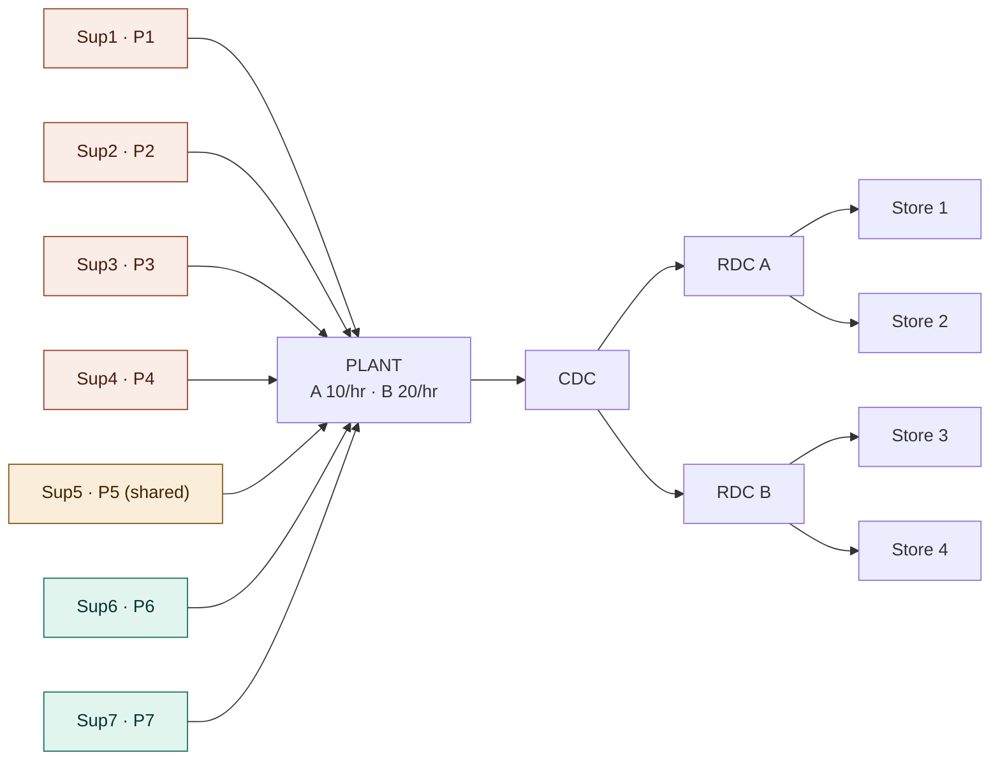

# Multi-Echelon Inventory Optimization in SAP IBP — A Worked Problem

A complete, numbers-in reference: the network, the forecasting case, and the inventory
calculations propagated from store shelf back to raw-material supplier — the way SAP IBP for
Inventory (MEIO) actually does it. Every concept you raised is answered, and the ones you
flagged as "missing" (transport full-loads, lead-time variance, scrap, bias, capacity) are
built in.

> **Reading note on notation.** Math is written in KaTeX (`$…$`). Numbers use a single
> consistent dataset defined in Part 1, so every result can be reproduced. Where a real IBP
> key figure exists I name it in `code style`.

---

## Table of contents

0. [The network](#part-0--the-network)
1. [Problem statement (the concrete case)](#part-1--problem-statement)
2. [The two horizons — the question that confuses everyone](#part-2--the-two-horizons)
3. [How MEIO actually works — the guaranteed-service model](#part-3--how-meio-works)
4. [Step-by-step calculation, store shelf → supplier](#part-4--step-by-step-calculation)
5. [The plant question, answered precisely](#part-5--the-plant-question)
6. [Risk pooling & variance propagation, in depth](#part-6--risk-pooling)
7. [Monitoring daily MAPE — Control Tower](#part-7--monitoring)
8. [What's commonly missed (your "accuracies")](#part-8--commonly-missed)
9. [Expansion to the full SAP IBP suite](#part-9--full-ibp-suite)
10. [Master result tables](#part-10--master-tables)
11. [Formula appendix](#appendix--formula-reference)

---

## Part 0 — The network

```
                            P1..P4 (A only)
   Sup1 ─┐                  P5     (shared)
   Sup2 ─┤                  P6..P7 (B only)
   Sup3 ─┼──►  PLANT  ──►  CDC  ──┬──►  RDC A ──┬──► Store 1
   Sup4 ─┤   (A 10/hr,            │             └──► Store 2
   Sup5 ─┤    B 20/hr)            │
   Sup6 ─┤                        └──►  RDC B ──┬──► Store 3
   Sup7 ─┘                                      └──► Store 4
   └ parts ┘   └ make ┘   └─────── finished goods (A + B) ───────┘
```



Five echelons. Inventory can sit at **any** of them. The whole job of MEIO is deciding *how
much* to hold *where*, so that the four stores hit their service target at the **lowest total
holding cost across the network** — not the cheapest at each node looked at alone. Those two
objectives give different answers, and that gap is exactly why a single-echelon "safety stock
at every location" calculation overstocks.

---

## Part 1 — Problem statement

### 1.1 Topology and BOM

| Echelon | Nodes |
|---|---|
| 0 — Suppliers | Sup1…Sup7 (Sup5 shared) |
| 1 — Plant | makes Product A and Product B |
| 2 — Central DC | CDC |
| 3 — Regional DCs | RDC A, RDC B |
| 4 — Stores | Store 1, 2 (under RDC A); Store 3, 4 (under RDC B) |

**Bill of materials** (parts consumed per *good* finished unit):

| Part | Supplier | per A | per B | incoming defect |
|---|---|---|---|---|
| P1 | Sup1 | 2 | — | 2% |
| P2 | Sup2 | 1 | — | 2% |
| P3 | Sup3 | 4 | — | **5%** |
| P4 | Sup4 | 1 | — | 2% |
| P5 | **Sup5** | 3 | 2 | 2% |
| P6 | Sup6 | — | 1 | 2% |
| P7 | Sup7 | — | 2 | 2% |

Sup5 is the coupling point: its demand is driven by **both** finished products, so its
variability is a blend of A's and B's forecast error. Keep an eye on it — it ends up holding
the largest buffer.

### 1.2 Production

| Product | Line rate (cycle time) | FG scrap |
|---|---|---|
| A | 10 units/hr | 3% |
| B | 20 units/hr | 2% |

### 1.3 The 90-day forecast (statistical demand plan)

Mean daily demand $\mu_d$ and forecast accuracy **MAPE** per store, per product. These come out
of `IBP for Demand` (statistical forecast + the historical forecast-error fit).

**Product A**

| Store | $\mu_d$ (u/day) | MAPE |
|---|---|---|
| 1 | 20 | 20% |
| 2 | 30 | 25% |
| 3 | 24 | 15% |
| 4 | 16 | 30% |
| **Σ** | **90** | |

**Product B**

| Store | $\mu_d$ (u/day) | MAPE |
|---|---|---|
| 1 | 12 | 18% |
| 2 | 18 | 22% |
| 3 | 14 | 20% |
| 4 | 10 | 28% |
| **Σ** | **54** | |

### 1.4 Lead times (mean, std), in days

**Procurement (supplier → plant):**

| Supplier | $L$ | $\sigma_L$ |
|---|---|---|
| Sup1 | 7 | 2 |
| Sup2 | 10 | 3 |
| Sup3 | 5 | 1 |
| Sup4 | 14 | 4 |
| Sup5 | 8 | 2 |
| Sup6 | 12 | 3 |
| Sup7 | 6 | 1.5 |

**Manufacturing (production lead time at plant):** A = (2, 0.4), B = (1.5, 0.3).
**Transit:** Plant→CDC (3, 0.5); CDC→RDC A (2, 0.4); CDC→RDC B (2.5, 0.5);
RDC A→Store1 (1, 0.2); RDC A→Store2 (1.5, 0.3); RDC B→Store3 (1, 0.2); RDC B→Store4 (2, 0.4).

### 1.5 Transport — full-truck-load constraint (the piece you said was missing)

You don't replenish continuously; a lane only moves when a truck fills. That turns every lane
into a **periodic review** with an interval $R = Q_{truck}/\text{(daily demand on the lane)}$,
and it creates **cycle stock** on top of safety stock.

| Lane | Truck cap $Q$ | Combined A+B demand/day | Review $R = Q/D$ |
|---|---|---|---|
| RDC→Store 1 | 120 | 32 | 3.75 d |
| RDC→Store 2 | 120 | 48 | 2.50 d |
| RDC→Store 3 | 120 | 38 | 3.16 d |
| RDC→Store 4 | 120 | 26 | 4.62 d |
| CDC→RDC A | 400 | 80 | 5.00 d |
| CDC→RDC B | 400 | 64 | 6.25 d |
| Plant→CDC | 800 | 144 | 5.56 d |
| Supplier→Plant | (MOQ-driven) | per part | $R_p = 5$ d assumed |

### 1.6 Service target

Customer-facing **cycle service level (CSL) = 95%** at every store ⇒ safety factor
$z = \Phi^{-1}(0.95) = 1.645$. (Internal echelons don't get an independent target imposed —
MEIO *chooses* their internal service so the stores hit 95% at minimum cost. More in Part 3.)

---

## Part 2 — The two horizons

> *"When you forecast for 90 days, what horizon do you size safety stock for — the full 90
> days, or something else?"*

This is the single most important conceptual point, so it gets its own part.

**There are two completely different time windows and they must not be conflated:**

1. **Forecast / planning horizon = 90 days.** This is *how far ahead you plan*. It gives you
   the demand *profile* over time (so you can see seasonality, ramps, promotions) and the
   *forecast-error statistics* (MAPE). It is the input.

2. **Coverage / exposure horizon = the net replenishment time at each node.** This is *how long
   you are exposed to being wrong before a replenishment can arrive*. **Safety stock is sized
   only for this window — never for the 90 days.**

Why never 90 days? Safety stock exists to absorb the *uncertainty you're exposed to during the
time it takes to react*. If a store can be restocked in 4.75 days, then a demand spike only hurts
for 4.75 days — after that the replenishment lands. Holding 90 days of buffer would be holding
~19× more inventory than the risk justifies.

So the 90-day forecast plays three roles, none of which is "the buffer window":

- It sets the **demand rate** $\mu_d$ used inside each node's coverage calculation.
- It sets the **forecast-error standard deviation** $\sigma_d$ (from MAPE).
- Because demand is usually **non-stationary** (a store sells more in week 9 than week 1), IBP
  recomputes the safety stock **per time bucket** across the 90 days. The *formula* is the same
  in every bucket; the $\mu_d$ and $\sigma_d$ feeding it change bucket to bucket. That gives a
  **time-phased safety stock** — a curve, not a single number — which is why IBP outputs
  `Safety Stock` as a key figure over the planning periods.

**Second subtle point — it's forecast *error*, not demand *variability*, that drives safety
stock.** A product can have wildly swinging but perfectly forecastable demand (strong seasonality
you predict exactly) and need almost *zero* safety stock. Conversely flat demand you forecast
badly needs a lot. The thing you buffer against is the part of demand your forecast *failed to
capture*. MAPE measures exactly that. This is why the input is MAPE/forecast-error, not the raw
coefficient of variation of sales.

The "exact distribution computed from production capacity and other stuff" you intuited is the
**next** stage: once MEIO has set the buffer *targets*, `IBP for Supply` (or Response) runs the
constrained plan — respecting the line rates, truck loads, supplier lead times — to decide the
*timed orders* that keep inventory near those targets. MEIO sets the targets; supply planning
realises them. Two engines, two jobs.

---

## Part 3 — How MEIO works

SAP IBP's inventory optimizer is a **guaranteed-service model (GSM)**, the Graves–Willems
formulation. Internalise these four objects and the whole thing falls out.

### 3.1 The four service-time objects at every stage $i$

- **Processing time $T_i$** — the deterministic time the stage itself adds (production time at
  the plant, transit time on a lane, handling at a DC).
- **Inbound service time $SI_i$** — how long stage $i$ waits to receive its inputs. By
  conservation it equals the *outbound* service time committed by its supplier:
  $SI_i = \max_{j \in \text{suppliers}(i)} S_j$.
- **Outbound service time $S_i$** — the time stage $i$ *guarantees* to deliver to its
  customer once asked. **This is the decision variable.** $0 \le S_i \le SI_i + T_i$.
- **Net replenishment time (the coverage window)**:
$$\tau_i = SI_i + T_i - S_i$$

Safety stock at the stage covers demand variability over $\tau_i$:
$$SS_i = z_i \,\sigma_i\, \sqrt{\tau_i}$$
where $\sigma_i$ is the (period) forecast-error std of the demand *that stage sees* (after
pooling — Part 6).

### 3.2 The optimization

Choose all $S_i$ to
$$\min \sum_i h_i \cdot z_i\,\sigma_i\sqrt{\tau_i}\qquad
\text{s.t. } S_{\text{store}} = 0,\;\; SI_i = \max_j S_j,\;\; 0 \le S_i \le SI_i+T_i,$$
where $h_i$ is the unit holding cost at stage $i$ (which **rises downstream** — more value added,
more locations, more handling). The stores must quote $S=0$ to the end customer (serve from
stock immediately).

### 3.3 What the optimizer discovers — the decoupling point

Because holding cost climbs as you go downstream, the optimizer's instinct is to **hold
inventory upstream where it's cheap and pooled, and quote short service times downstream by
holding only a thin buffer there.** The place where it parks the big buffer is the **decoupling
point** (a.k.a. push/pull boundary, or the CODP). Two extreme readings of one chain:

- If the CDC becomes the decoupling point: it sets $S_{CDC}=0$ (ships to RDCs on demand). Then
  each RDC's $\tau_{RDC} = 0 + T_{transit} - S_{RDC}$, and if the RDC also decouples,
  $\tau_{RDC} = T_{transit}$ — a *short* window, so a *small* buffer, even though demand there is
  less pooled.
- If instead you pushed all stock to the stores, each store would carry the full
  $SI+T$ window of buffer at the most expensive, least-pooled echelon. Far more total inventory.

The optimizer finds the cost-minimising split automatically via dynamic programming over the
tree. In practice for a network like this it lands on **deep, pooled buffers at the CDC and the
plant, lean buffers at RDCs and stores** — which is precisely the "hold it high, pooled, and
quote fast" pattern.

> **Two ways to read the numbers below.** Part 4 first computes the **decoupled / single-echelon
> base-stock** value at each node (every node sized for its *own* $L+R$ window) because it's the
> intuitive arithmetic and matches what most people picture. Then I show how GSM *coordinates the
> service times* to cut the total. The decoupled numbers are the **upper bound**; GSM's coordinated
> answer is lower. IBP reports the coordinated answer.

---

## Part 4 — Step-by-step calculation

Worked for **Product A** end-to-end (Product B is identical arithmetic with its own numbers;
its pooled results are tabulated in Part 10). Currency of the calculation: **units of A per day**.

### Step 1 — Turn MAPE into a forecast-error standard deviation

For approximately-normal forecast errors, the mean absolute deviation relates to the std by
$\text{MAD} = \sigma\sqrt{2/\pi} \approx 0.7979\,\sigma$, hence $\sigma \approx 1.25\,\text{MAD}$.
Treating $\text{MAD} \approx \text{MAPE}\times\mu$:
$$\boxed{\;\sigma_d \approx 1.25 \cdot \text{MAPE} \cdot \mu_d\;}$$

> If your IBP setup feeds the **forecast-error CV** directly instead, you skip the 1.25 and use
> $\sigma_d = \text{CV}\cdot\mu_d$. Keep one convention; I use the 1.25 form throughout.

**Product A, per store:**

| Store | $\mu_d$ | MAPE | $\sigma_d = 1.25\cdot\text{MAPE}\cdot\mu_d$ |
|---|---|---|---|
| 1 | 20 | 0.20 | **5.000** |
| 2 | 30 | 0.25 | **9.375** |
| 3 | 24 | 0.15 | **4.500** |
| 4 | 16 | 0.30 | **6.000** |

### Step 2 — Propagate demand *means* upstream (BOM is downstream-of-plant trivial here; aggregation is the action)

Means simply add up the tree:

- RDC A sees Store1 + Store2 ⇒ $\mu = 20+30 = 50$
- RDC B sees Store3 + Store4 ⇒ $\mu = 24+16 = 40$
- CDC sees RDC A + RDC B ⇒ $\mu = 90$
- Plant FG (A) sees CDC ⇒ $\mu = 90$ good units/day

### Step 3 — Pool *variance* at the RDCs (this is risk pooling)

Independent demand streams ⇒ **variances add**, std grows by the square-root law (not linearly):
$$\sigma_{\text{pooled}} = \sqrt{\textstyle\sum_k \sigma_k^2}$$

- **RDC A:** $\sigma = \sqrt{5.000^2 + 9.375^2} = \sqrt{25 + 87.89} = \mathbf{10.625}$
  (naïve sum would be $5+9.375 = 14.375$ → pooling saves 26%.)
- **RDC B:** $\sigma = \sqrt{4.5^2 + 6^2} = \sqrt{20.25+36} = \mathbf{7.500}$

### Step 4 — Pool again at the CDC

- **CDC:** $\sigma = \sqrt{10.625^2 + 7.5^2} = \sqrt{112.89 + 56.25} = \mathbf{13.01}$
  (naïve sum of the four stores would be $24.875$; pooled is $13.01$ — the CDC buffers ~48% less
  variability *per unit of throughput* than the stores do, the core reason central stock is
  efficient.)

### Step 5 — Net replenishment time per node (with the FTL review period folded in)

In the **decoupled** read, each node covers its own inbound lead time **plus** its review
interval, because under periodic review you must survive until the *next* order *plus its* lead
time arrives: coverage $= L + R$.

With **both demand and lead-time variable**, the standard deviation of demand-over-coverage is
(Silver–Pyke–Peterson):
$$\sigma_{DDLT} = \sqrt{(L+R)\,\sigma_d^{2} + \mu_d^{2}\,\sigma_L^{2}}$$
The first term is demand risk; the second is **lead-time risk** (note it scales with $\mu_d^2$ —
for fast-moving items or shaky suppliers it dominates, which you'll see explode in Step 9).

Then $SS = z\cdot\sigma_{DDLT}$, with $z = 1.645$.

### Step 6 — Safety stock at the customer-facing and distribution nodes (Product A)

| Node | $\mu_d$ | $\sigma_d$ | $L$ | $\sigma_L$ | $R$ | $L{+}R$ | $\sigma_{DDLT}$ | **SS** = $1.645\,\sigma_{DDLT}$ |
|---|---|---|---|---|---|---|---|---|
| Store 1 | 20 | 5.000 | 1.0 | 0.2 | 3.75 | 4.75 | 11.61 | **19.1** |
| Store 2 | 30 | 9.375 | 1.5 | 0.3 | 2.50 | 4.00 | 20.80 | **34.2** |
| Store 3 | 24 | 4.500 | 1.0 | 0.2 | 3.16 | 4.16 | 10.36 | **17.0** |
| Store 4 | 16 | 6.000 | 2.0 | 0.4 | 4.62 | 6.62 | 16.71 | **27.5** |
| RDC A | 50 | 10.625 | 2.0 | 0.4 | 5.00 | 7.00 | 34.50 | **56.8** |
| RDC B | 40 | 7.500 | 2.5 | 0.5 | 6.25 | 8.75 | 29.87 | **49.1** |
| CDC | 90 | 13.010 | 3.0 | 0.5 | 5.56 | 8.56 | 58.93 | **96.9** |

Worked example, Store 1:
$\sigma_{DDLT}=\sqrt{4.75(5)^2 + 20^2(0.2)^2}=\sqrt{118.75+16}=\sqrt{134.75}=11.61$ ⇒
$SS = 1.645\times 11.61 = 19.1$ units.

> **GSM coordination on top of this.** The table sizes every node independently. GSM then lowers
> the total: if the CDC guarantees, say, $S_{CDC}=1$ day to the RDCs, each RDC's $\tau$ shrinks
> from $L+R$ to roughly $S_{CDC}+T-S_{RDC}$, so the RDC buffers shrink and the (cheaper, pooled)
> CDC buffer grows slightly to cover the promise. Net inventory **cost** falls because you traded
> expensive downstream buffer for cheap upstream buffer. IBP's optimizer searches all these
> service-time splits; the decoupled table is the ceiling.

### Step 7 — Plant finished-goods safety stock

The plant holds FG buffer for A so it can answer the CDC without waiting for a full production
campaign. Its coverage is the **manufacturing replenishment window**, *not* anything to do with
the 90 days, and *not* the procurement lead time (that's covered separately by raw-material
buffer in Step 9 — the plant holds parts so it can start at will).

$$\tau_{\text{plant FG}} = SI_{\text{parts committed}} + L_{\text{mfg}} - S_{\text{plant→CDC}}$$

In the decoupled read with parts on hand: coverage $= L_{\text{mfg}} + R_{\text{prod}}$. The plant
shares one line between A and B, so it runs **campaigns**; take the campaign cycle
$R_{\text{prod}} = 3$ days. With $L_{\text{mfg,A}}=2$, $\sigma=0.4$:

$$\sigma_{DDLT}=\sqrt{(2+3)(13.01)^2 + 90^2(0.4)^2}=\sqrt{845.7+1296}=\sqrt{2141.7}=46.28$$
$$SS_{\text{plant FG, A}} = 1.645\times 46.28 = \mathbf{76.1}\ \text{units}$$

**Where does the line rate matter?** The 10 u/hr rate fixes (a) the *manufacturing lead time*
$L_{\text{mfg}}$ — to make a batch of $Q$ takes $Q/10$ hr + setup — and (b) the *capacity check*:
to ship 90 good A/day you must **produce** $90/0.97=92.8$/day ⇒ $9.28$ machine-hours; B needs
$54/0.98=55.1$ at 20/hr $=2.76$ h; together $\approx 12$ h/day. Comfortably inside a 16-h
two-shift day, so the unconstrained GSM result is valid here. If that total had exceeded
capacity, you'd move to **capacity-constrained MEIO** and **pre-build** seasonal stock (Part 8).

### Step 8 — Explode the BOM and apply yield to get part demand

Two yield effects, applied in order:

1. **FG scrap** inflates *production* above shipments: produce $\mu_A/(1-s_A^{FG})$.
   $\;A_{prod} = 90/0.97 = 92.78$/day, $\;B_{prod} = 54/0.98 = 55.10$/day.
2. **Part incoming defect** inflates *ordering* above consumption: order
   consumption$/(1-s_{part})$.

**Part consumption** (good parts/day) $= \sum_{FG} \text{BOM}\times \text{prod}$:

| Part | formula | consumption/day | order/day (÷ $(1{-}s)$) |
|---|---|---|---|
| P1 | $2\times92.78$ | 185.57 | 189.36 |
| P2 | $1\times92.78$ | 92.78 | 94.67 |
| P3 | $4\times92.78$ | 371.13 | 390.66 (÷0.95) |
| P4 | $1\times92.78$ | 92.78 | 94.67 |
| P5 | $3\times92.78 + 2\times55.10$ | **388.55** | 396.48 |
| P6 | $1\times55.10$ | 55.10 | 56.22 |
| P7 | $2\times55.10$ | 110.20 | 112.45 |

**Part demand variability** (propagate FG forecast error through the BOM coefficients). At plant
level the FG forecast-error stds are the *pooled CDC* values: $\sigma_A = 13.01$, $\sigma_B = 7.50$
(B from Part 10). Assuming A and B forecast errors independent, for a part used by both:
$$\sigma_{part} = \sqrt{(\text{BOM}_A\,\sigma_A)^2 + (\text{BOM}_B\,\sigma_B)^2}$$

| Part | $\sigma_{part}$ |
|---|---|
| P1 | $2\times13.01 = 26.02$ |
| P2 | $13.01$ |
| P3 | $4\times13.01 = 52.04$ |
| P4 | $13.01$ |
| P5 | $\sqrt{(3\cdot13.01)^2+(2\cdot7.50)^2}=\sqrt{1523.3+225.2}= \mathbf{41.82}$ |
| P6 | $7.50$ |
| P7 | $2\times7.50 = 15.01$ |

> Scrap is not just a mean shift — yield has variance too. If yield std is material, add it in
> quadrature: $\sigma_{part}^2 \mathrel{+}= (\mu_{part}\,\sigma_{yield}/\bar{y})^2$. Omitted in the
> table for clarity; flagged in Part 8.

### Step 9 — Raw-material safety stock at the plant (supplier lead-time risk)

Each part is buffered for **its own supplier's** lead time and lead-time variance — you do **not**
copy the CDC's or plant-FG target down to parts. Same formula, now $L,\sigma_L$ are the
*procurement* values and $R_p=5$:
$$\sigma_{DDLT}=\sqrt{(L+R_p)\sigma_{part}^2 + \mu_{part}^2\sigma_L^2},\qquad SS = 1.645\,\sigma_{DDLT}$$
($\mu_{part}$ = consumption/day.)

| Part | Sup | $\mu$ | $\sigma_d$ | $L$ | $\sigma_L$ | $L{+}R_p$ | demand term | **LT term** | $\sigma_{DDLT}$ | **SS** |
|---|---|---|---|---|---|---|---|---|---|---|
| P1 | 1 | 185.57 | 26.02 | 7 | 2 | 12 | 8 124 | 137 745 | 381.9 | **628** |
| P2 | 2 | 92.78 | 13.01 | 10 | 3 | 15 | 2 539 | 77 473 | 282.9 | **465** |
| P3 | 3 | 371.13 | 52.04 | 5 | 1 | 10 | 27 082 | 137 737 | 406.0 | **668** |
| P4 | 4 | 92.78 | 13.01 | 14 | 4 | 19 | 3 216 | 137 730 | 375.4 | **618** |
| P5 | 5 | 388.55 | 41.82 | 8 | 2 | 13 | 22 736 | 603 884 | 791.6 | **1 302** |
| P6 | 6 | 55.10 | 7.50 | 12 | 3 | 17 | 957 | 27 324 | 168.2 | **277** |
| P7 | 7 | 110.20 | 15.01 | 6 | 1.5 | 11 | 2 477 | 27 324 | 172.6 | **284** |

Read the two right-hand contribution columns: for P4 (Sup4, 14-day lead time, $\sigma_L=4$) the
**lead-time term (137 730) is ~43× the demand term (3 216)** — its buffer is almost entirely
defending against an unreliable supplier, not against demand noise. Same story for P2 and P5.
**This is the headline lesson for raw materials: supplier lead-time *variance*, not demand
variance, sets the buffer for fast-moving or BOM-heavy parts.** The cheapest way to shrink the
P4/P5 buffers is not a better forecast — it's a more reliable supplier (cut $\sigma_L$).

P5's buffer (1 302) is the largest in the whole network: high consumption (used by A and B),
high BOM coefficient, and a non-trivial supplier $\sigma_L$. That single shared supplier is your
biggest working-capital and risk concentration — worth dual-sourcing or a tighter SLA.

### Step 10 — Add cycle stock and pipeline stock; assemble the target

Safety stock is only one of three inventory layers. The **target stock level** (order-up-to $S$)
and the **average on-hand** include all three:

- **Cycle stock** (from ordering in truckloads): average $= \tfrac{1}{2}\times$ order quantity.
  Per product on a lane $\approx \tfrac{R\,\mu_d}{2}$.
  e.g. Store 1 (A): $\tfrac{3.75\times20}{2}=37.5$ u.
- **Pipeline / in-transit stock** (units moving on a lane, on average): $\mu_d \times L_{transit}$.
  e.g. CDC→RDC A (A): $50 \times 2 = 100$ u in transit at any moment. This is working capital you
  *own* even though it's on a truck — easy to forget in a TCO model.
- **Order-up-to level** $S = \mu_d(L+R) + SS$.
  e.g. Store 1 (A): $20\times4.75 + 19.1 = 95 + 19.1 = 114.1$ u.

So the full picture at Store 1 for product A: reorder logic targets ~114 units; of that, ~95 is
working/cycle stock that turns over each cycle, and **19 is the safety buffer**. Multiply across
products, stores, lanes and echelons and you get total network inventory — what the TCO and
working-capital lines actually see.

### Step 11 — How safety stock enters the net-requirement (the MRP question)

> *"Is it just Net requirement = On hand − xxx?"* — Almost, but the sign of safety stock is the
> opposite of what the phrasing suggests: safety stock **raises** the requirement, because it's a
> level you must *maintain*, not consume.

$$\boxed{\;\text{Net requirement} = \text{Gross requirement} + \text{Safety stock} - \text{On-hand} - \text{Scheduled receipts} + \text{Allocations}\;}$$

- **Gross requirement** = the period's demand (for parts, the BOM-exploded dependent demand from
  Step 8, after lead-time offsetting).
- **+ Safety stock** = top-up so you *end* the period at the target buffer.
- **− On-hand − Scheduled receipts** = what you already have or have coming.

MEIO's deliverable is the `Safety Stock` (and `Reorder Point`/`Target Stock`) key figures.
`IBP for Supply`/`Response` then runs MRP-style netting **with those targets plugged in**, offsets
each order by its lead time (procurement, manufacturing, transit), and respects capacity and lot
sizes to emit the actual planned orders / stock-transfers / production orders. That's where your
"exact distribution based on production capacity" lives.

---

## Part 5 — The plant question, answered precisely

You asked several tightly-related things about the plant. Point by point:

**Q: "Lead time from plant to central hub involves what — manufacturing lead time for what
period, and transit too?"**
The CDC's *inbound* replenishment time from the plant is
$$\underbrace{S_{\text{plant→CDC}}}_{\text{how fast the plant can respond}} + \underbrace{T_{\text{plant→CDC}}}_{\text{transit }=3\text{ d}}.$$
If the plant holds FG buffer (Step 7), it ships almost immediately ⇒ $S_{\text{plant}}\approx$ a
small handling time, so the CDC effectively sees ~the **3-day transit**. The **manufacturing lead
time does *not* add into the CDC's coverage** in that case — it instead sizes the *plant's own* FG
buffer. The manufacturing lead time is "for" the **production replenishment cycle** (time to make
and replace a batch), never "for the 90 days."

**Q: "Do you recalculate the safety-stock target at the plant, or take the central hub's target
directly?"**
You **recalculate**. Every node sizes its buffer from *its own* net replenishment time and the
demand/variance *it* faces. The plant does **not** inherit the CDC's number. The plant in fact
holds **two distinct buffers**:

1. **FG buffer** (A, B) — coverage = mfg lead time (+ campaign cycle) − service promised to CDC
   (Step 7).
2. **Raw-material buffer** (P1…P7) — coverage = each supplier's lead time + part review (Step 9),
   demand = BOM-exploded, yield-inflated (Step 8).

**Q: "Then based on each supplier's lead-time variance you just compute the individual part's
buffer accordingly?"**
Exactly — see the Step 9 table. Each part's $SS$ uses *that supplier's* $L,\sigma_L$ and *that
part's* $\mu,\sigma$. Independent per part. The only coupling is **demand-side**: P5's demand
variance blends A and B (Step 8) because Sup5 is shared.

**Q: "Internal service times — how do they apply here?"**
The plant's $S_{\text{plant→CDC}}$ *is* an internal service time, and it's a *decision*. Promise
the CDC a fast service (small $S$) and the CDC carries less buffer but the plant carries more;
promise slow and it flips. GSM (Part 3) picks the split that minimises total cost. Same logic on
every internal arc (CDC→RDC, RDC→store). The end-customer arc alone is fixed at $S=0$.

---

## Part 6 — Risk pooling

### 6.1 The square-root law

Consolidating $n$ independent, statistically-identical demand streams into one location cuts the
*relative* variability (and thus the safety stock per unit of throughput) by $\sqrt{n}$:
$$\frac{SS_{\text{pooled}}}{SS_{\text{separate}}} = \frac{\sqrt{\sum\sigma_k^2}}{\sum\sigma_k} \xrightarrow{\text{identical}} \frac{1}{\sqrt{n}}.$$
This is *the* mathematical reason a central buffer beats the same buffer spread across stores —
and why MEIO pushes stock upstream where streams have merged.

### 6.2 Where pooling happens in this network

Pooling occurs at **every convergence**: two stores merge at each RDC, two RDCs merge at the CDC,
two products merge on the shared supplier Sup5. The std grows by the square root of summed
variances each time (Steps 3–4, 8).

### 6.3 The independence assumption — and the correction you must not skip

The clean $\sigma=\sqrt{\sum\sigma_k^2}$ holds **only if the streams are independent**. They often
aren't: a regional promotion, weather, or a national campaign makes Store 1 and Store 2 spike
*together* (positive correlation $\rho$). Then:
$$\sigma_{\text{pooled}} = \sqrt{\sum_k \sigma_k^2 + 2\sum_{j<k}\rho_{jk}\,\sigma_j\sigma_k}.$$
Positive $\rho$ **erodes the pooling benefit** (at $\rho=1$ it vanishes — variability adds
linearly again). IBP can be parameterised with demand correlations; if you assume independence
when demand is actually correlated, **you will under-buffer**. This is one of the most common
real-world MEIO errors.

### 6.4 Combined demand + lead-time variance — why both terms exist

Demand-during-lead-time is a random *sum* of a random *number* of periods. By the law of total
variance, for independent demand and lead time:
$$\operatorname{Var}(DDLT) = E[L]\operatorname{Var}(d) + E[d]^2\operatorname{Var}(L)
\;\Rightarrow\; \sigma_{DDLT}=\sqrt{L\sigma_d^2 + \mu_d^2\sigma_L^2}.$$
The $\mu_d^2\sigma_L^2$ term is why a *reliable* supplier (small $\sigma_L$) is worth more than a
*fast* one for high-volume parts — and why Step 9's P4 buffer is dominated by supply risk.

---

## Part 7 — Monitoring

> *"Each store's actual daily MAPE gets recorded — how do you monitor and react?"*

This is the closed-loop layer, and in SAP it's **`IBP Control Tower` + demand-driven re-planning**.

**Forecast-accuracy KPIs, tracked per store/product/period:** MAPE, WMAPE, bias, MAD, RMSE. These
update as actuals post (daily for stores). Control Tower shows them on dashboards with thresholds.

**Exception alerts (the reactive part):**
- *Accuracy alert* — when realised MAPE breaches a band (e.g. a store's MAPE jumps from 20% to
  35%), an alert fires; the planner reviews the model and, importantly, the safety stock at that
  node is now under-sized (its $\sigma_d$ went up) and gets re-optimised on the next run.
- *Inventory alert* — projected stock dips below the buffer / target.
- *Capacity / supply alert* — a lane or supplier slips.

**Bias vs. error — the tracking signal.** MAPE measures *magnitude* of error but is blind to
*direction*. A model that's consistently 10% low has modest MAPE but a persistent bias that safety
stock cannot fix (you'd just stock-out repeatedly on the same side). Watch the **tracking
signal** $TS = \dfrac{\text{running sum of errors}}{\text{MAD}}$; $|TS|>4$ flags a biased model
that needs *correcting*, not buffering.

**Re-planning cadence (the auto-correction):**
- **Demand sensing** (`IBP for Demand`, the DS engine) blends very recent actuals, orders, and
  short-term signals to revise the **near-horizon** forecast daily — far more responsive than the
  90-day statistical forecast.
- The **inventory optimization run** re-fires on a cadence (often weekly): refreshed $\mu_d$ and
  $\sigma_d$ feed the GSM, so buffers **breathe** up and down with measured accuracy and
  seasonality. This is why safety stock is a *living time-phased curve*, not a static number.
- **Response planning** re-nets orders against the new targets in near-real-time.

So the daily-MAPE feedback enters in three places: it flags exceptions (Control Tower), it
reshapes the near-term forecast (Demand Sensing), and it resizes buffers (next IO run).

---

## Part 8 — Commonly missed

The "accuracies" you suspected you'd left out — here they are, each with the fix:

1. **Forecast bias ≠ forecast error.** MAPE ignores direction; track the tracking signal and
   de-bias the model. Safety stock only cures *random* error.
2. **Demand correlation in pooling.** Independence is the optimistic case. Correlated stores ⇒
   add the covariance term (§6.3) or you under-buffer.
3. **Yield/scrap *variance*, not just the mean.** Variable yield adds to component demand variance
   (Step 8 note). High-scrap parts like P3 deserve the extra term.
4. **Capacity-constrained MEIO & pre-build.** Unbounded GSM assumes you can always replenish in
   the lead time. If a peak exceeds the line rate (here ~12 h/day used of ~16 available, so OK),
   you must **pre-build** ahead of the peak — seasonal stock, a fourth inventory layer beyond
   cycle/safety/pipeline.
5. **Pipeline (in-transit) stock.** Owned inventory on trucks (§Step 10). It's real working capital
   and belongs in the TCO; easy to omit.
6. **Cycle stock from FTL/MOQ.** Full-truck and minimum-order rules force batching ⇒ $Q/2$ cycle
   stock and the periodic-review $R$ that *widens* the safety-stock window to $L+R$. (Built in
   throughout — this was your "transport matters" point, and it touches *both* cycle stock *and*
   safety stock.)
7. **Review-period inflation.** Because you ship on a truck cadence, coverage is $L+R$, not $L$.
   Continuous-review math undersizes the buffer.
8. **Service-level *type*.** Cycle service level (prob. of *no* stockout per cycle, what $z$ gives)
   ≠ fill rate (fraction of *demand* met). For the same target number they imply different
   buffers; pick deliberately. IBP supports both.
9. **Shelf life / perishability, MOQ, min/max, rounding.** All real constraints IBP's IO and
   supply engines accept; they cap or quantise the otherwise-continuous targets.
10. **Postponement / decoupling-point design.** *Where* in the network you hold semi-finished vs.
    finished stock is itself a lever (§3.3). Pushing the decoupling point upstream (hold generic
    sub-assemblies, finish to order) slashes finished-goods variety risk — the strategic cousin of
    risk pooling.
11. **Shared-resource coupling (your Sup5).** A component feeding multiple products carries blended
    variance and is a single point of failure — model its demand variance as the *combination*
    (Step 8) and treat the supplier risk seriously (dual-source / SLA).
12. **Holding-cost gradient is the hidden driver.** GSM's entire push-it-upstream behaviour comes
    from $h_i$ rising downstream. If your cost data is flat or wrong, the optimizer parks stock in
    the wrong place. Get the per-echelon holding costs right.

---

## Part 9 — Full SAP IBP suite

How the modules chain for this exact problem (and what each one owns):

| Module | Owns | In this problem |
|---|---|---|
| **IBP for Demand** | Statistical forecast, **demand sensing**, forecast-error/MAPE | Produces the 90-day store forecasts and the MAPE that becomes $\sigma_d$ |
| **IBP for Inventory (MEIO)** | The GSM safety-stock optimizer; `Safety Stock`, `Target Stock`, `Reorder Point` | Everything in Parts 3–6: pools variance, sets time-phased buffers at every node, decoupling-point logic |
| **IBP for Supply (S&OP)** | Constrained mid/long-range supply plan (heuristic **or** optimizer) | Takes the buffers as targets, runs MRP-style netting + BOM explosion + lead-time offset + **capacity** + lot sizes ⇒ production & procurement plan |
| **IBP for Response & Supply** | Order-based, near-real-time allocation & deployment | Daily re-netting against targets; deployment/stock-transfer to RDCs and stores; backorder prioritisation |
| **IBP Control Tower** | KPIs, alerts, exception management, what-if | Watches daily MAPE, inventory, capacity; fires the alerts in Part 7 |
| **DDMRP in IBP** *(alternative buffering)* | Decoupled buffers (red/yellow/green zones), decoupled lead time | A different philosophy to §3 — buffer *positions* + zones instead of pure statistical $z\sigma\sqrt\tau$; useful where lead times are long and BOMs deep (your P2/P4/P5) |

**Data flow:**
`Demand` (forecast + MAPE) → `Inventory/MEIO` (buffers) → `Supply`/`Response` (orders, respecting
capacity & FTL) → execution → actuals → `Control Tower` (monitor) → back to `Demand` (sense) and
`Inventory` (re-optimise). The loop is the system.

**DDMRP contrast worth knowing.** GSM (what we used) is *statistical and optimization-driven*: it
computes the cost-minimal buffer set assuming you can characterise demand and lead-time
distributions. DDMRP is *signal- and zone-driven*: it positions decoupling points, sizes buffer
zones from average daily usage × decoupled lead time × variability factors, and plans against the
*net flow position*. For deep BOMs with long, variable procurement (your Sup2/Sup4/Sup5), teams
often run **DDMRP for the part/decoupling layer** and **statistical MEIO for the distribution
layer** — IBP supports both under one roof.

---

## Part 10 — Master tables

### 10.1 Forecast-error std (both products)

| Store | A: $\sigma_d$ | B: $\sigma_d$ |
|---|---|---|
| 1 | 5.000 | 2.70 |
| 2 | 9.375 | 4.95 |
| 3 | 4.500 | 3.50 |
| 4 | 6.000 | 3.50 |

### 10.2 Pooled variability up the tree

| Node | A: $\mu$ / $\sigma$ | B: $\mu$ / $\sigma$ |
|---|---|---|
| RDC A | 50 / 10.625 | 30 / 5.638 |
| RDC B | 40 / 7.500 | 24 / 4.950 |
| CDC | 90 / 13.01 | 54 / 7.503 |

### 10.3 Safety stock by node — Product A (decoupled upper bound)

| Node | SS (units of A) |
|---|---|
| Store 1 | 19.1 |
| Store 2 | 34.2 |
| Store 3 | 17.0 |
| Store 4 | 27.5 |
| RDC A | 56.8 |
| RDC B | 49.1 |
| CDC | 96.9 |
| Plant (FG) | 76.1 |

### 10.4 Raw-material safety stock at the plant (part units)

| Part | Sup | SS | dominant risk |
|---|---|---|---|
| P1 | 1 | 628 | lead-time |
| P2 | 2 | 465 | lead-time |
| P3 | 3 | 668 | mixed |
| P4 | 4 | 618 | **lead-time (43:1)** |
| P5 | 5 | 1 302 | lead-time (largest in network) |
| P6 | 6 | 277 | lead-time |
| P7 | 7 | 284 | lead-time |

### 10.5 The three inventory layers (illustrative, Store 1 · Product A)

| Layer | Value | Driver |
|---|---|---|
| Cycle stock | 37.5 | FTL review $R=3.75$ d |
| Safety stock | 19.1 | $z\,\sigma_{DDLT}$, 95% CSL |
| Pipeline (RDC→store) | 20.0 | $\mu_d\times L = 20\times1$ |
| **Order-up-to $S$** | **114.1** | $\mu_d(L+R)+SS$ |

---

## Appendix — Formula reference

| Concept | Formula |
|---|---|
| MAPE → error std | $\sigma_d \approx 1.25\cdot\text{MAPE}\cdot\mu_d$ |
| Pooled std (independent) | $\sigma=\sqrt{\sum_k \sigma_k^2}$ |
| Pooled std (correlated) | $\sigma=\sqrt{\sum_k\sigma_k^2+2\sum_{j<k}\rho_{jk}\sigma_j\sigma_k}$ |
| Demand-during-lead-time std | $\sigma_{DDLT}=\sqrt{(L+R)\sigma_d^2+\mu_d^2\sigma_L^2}$ |
| Safety stock | $SS=z\cdot\sigma_{DDLT}$, $z=\Phi^{-1}(\text{CSL})$ |
| Net replenishment time (GSM) | $\tau_i=SI_i+T_i-S_i,\quad SI_i=\max_j S_j$ |
| GSM safety stock | $SS_i=z\,\sigma_i\sqrt{\tau_i}$ |
| GSM objective | $\min\sum_i h_i z\sigma_i\sqrt{\tau_i}$ s.t. $S_{\text{cust}}=0$ |
| Production for yield | $\text{prod}=\mu/(1-s^{FG})$ |
| Order for part defect | $\text{order}=\text{consumption}/(1-s_{part})$ |
| Cycle stock | $\approx Q/2 = R\,\mu_d/2$ |
| Pipeline stock | $\mu_d\times L_{transit}$ |
| Order-up-to level | $S=\mu_d(L+R)+SS$ |
| Net requirement (MRP) | $GR + SS - \text{on-hand} - \text{receipts} + \text{allocations}$ |
| Tracking signal (bias) | $TS=\sum e_t / \text{MAD}$; act if $|TS|>4$ |
| FTL review interval | $R = Q_{truck}/D_{lane}$ |

---

*Single-line takeaway:* the 90-day forecast feeds **rates and error**, MEIO buffers only the
**net-replenishment window** at each node, **pooling shrinks** variability up the tree, **supplier
lead-time variance** (not demand) dominates raw-material buffers, **full-truck-loads** add cycle
stock and widen the window, and the whole thing is a **closed loop** kept honest by Control Tower
and demand sensing.
